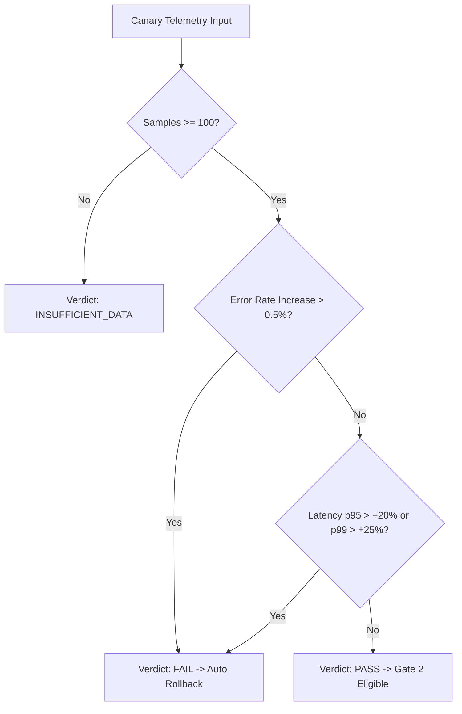

# DevOnCall — Phase 12 Canary Telemetry & Decision Engine Guide

## Overview

The **Canary Decision Engine** continuously compares real-time production telemetry between the active production baseline and the canary release candidate.

---

## Canary Policy & Bounds

- **Traffic Bounds**: Strictly enforced between **1.0%** and **10.0%**. Attempts to request >10% traffic for initial canary releases are rejected.
- **Evaluation Windows**: 5-minute sampling intervals comparing baseline vs candidate metrics.

---

## Decision Engine Metric Evaluation

| Metric | Max Acceptable Threshold | Formula |
|---|---|---|
| **Error Rate Increase** | `+0.5%` absolute increase | `candidate_error_rate - baseline_error_rate <= 0.005` |
| **Latency p95 Increase** | `+20%` relative increase | `candidate_p95 <= baseline_p95 * 1.20` |
| **Latency p99 Increase** | `+25%` relative increase | `candidate_p99 <= baseline_p99 * 1.25` |
| **Minimum Sample Count** | `100 requests` | `candidate_total_requests >= 100` |

---

## Decision Engine Verdict Matrix

> [!IMPORTANT]
> `INSUFFICIENT_DATA` verdicts are NEVER converted to `PASS`. If telemetry sample count is inadequate, the engine mandates `HUMAN_REVIEW` before proceeding to Gate 2.
