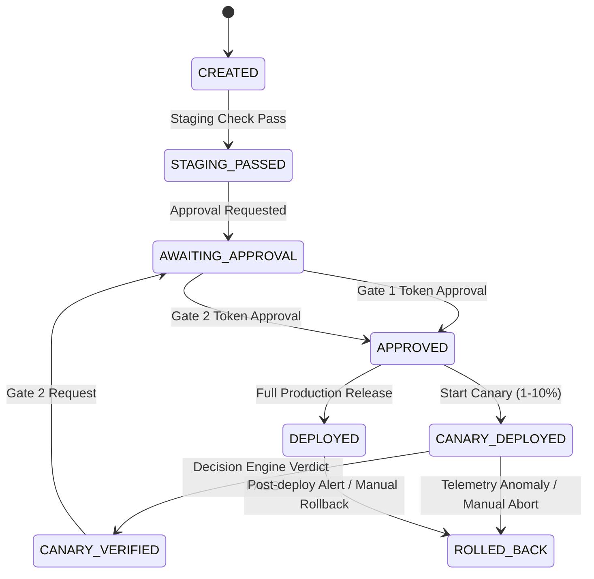

# DevOnCall — Phase 12 Controlled Canary Deployment & Production Safety Gate

## Overview

Phase 12 establishes DevOnCall's **Controlled Production Release Gate**. It guarantees that no code change can reach production without passing through a multi-stage, approval-gated state machine with automated telemetry verification and emergency rollback capabilities.

---

## State Machine Lifecycle



---

## Security & Safety Controls

1. **Double Human Approval Gates**:
   - **Gate 1**: Canary Release Approval (5% traffic bound).
   - **Gate 2**: Full Production Deployment Approval (100% traffic bound).

2. **Commit SHA Immutability**:
   - Requires exact 40-character hexadecimal git commit SHA.
   - Strictly REJECTS floating tags (`latest`, `main`, `master`, branch names).

3. **Confirmation Token Security**:
   - Single-use, cryptographically secure 10-minute confirmation tokens required for all state-changing operations.

4. **Credential Isolation**:
   - Production secrets and credentials reside strictly inside deployment provider adapters.
   - NEVER exposed in AgentState, LLM prompts, WhatsApp, or API payloads.

5. **Read-Only LLM Permission Level**:
   - AI Agent Runtime tools for deployment (`release_candidate_status`, `canary_verification_details`, `deployment_audit_log`) are enforced as `ToolPermission.READ_ONLY`.
   - LLM agents possess **ZERO** direct production write access.

---

## Deployment Provider Abstraction

Production deployments execute exclusively through the `BaseDeploymentProvider` interface:

```python
class BaseDeploymentProvider(ABC):
    @abstractmethod
    async def create_canary_deployment(self, commit_sha: str, traffic_percent: float) -> Dict[str, Any]: ...
    @abstractmethod
    async def update_canary_traffic(self, deployment_id: str, traffic_percent: float) -> bool: ...
    @abstractmethod
    async def promote_canary_to_production(self, deployment_id: str) -> Dict[str, Any]: ...
    @abstractmethod
    async def rollback(self, target_commit_sha: str, reason: str) -> Dict[str, Any]: ...
```

---

## Verification & Auditability

Every release candidate records immutable events in `DeploymentAuditLogModel`:
- Candidate creation
- Approval requests and decisions
- Canary traffic adjustments
- Telemetry verifications
- Full production deployments
- Emergency rollbacks
